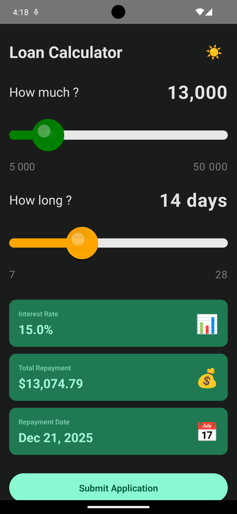
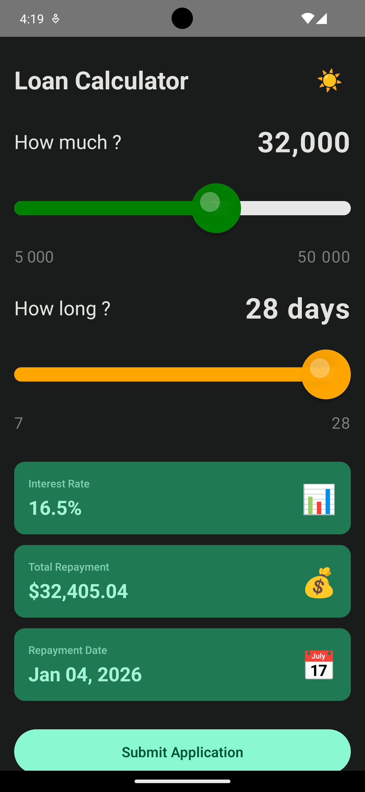
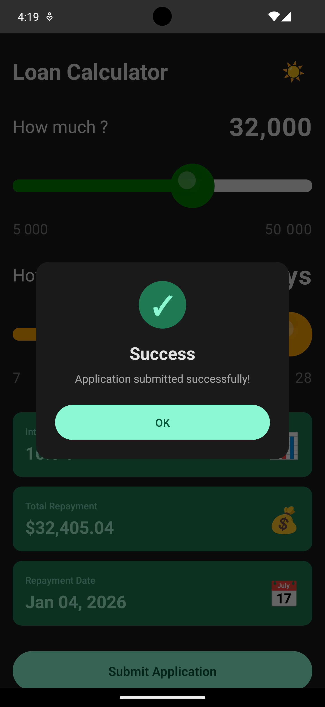
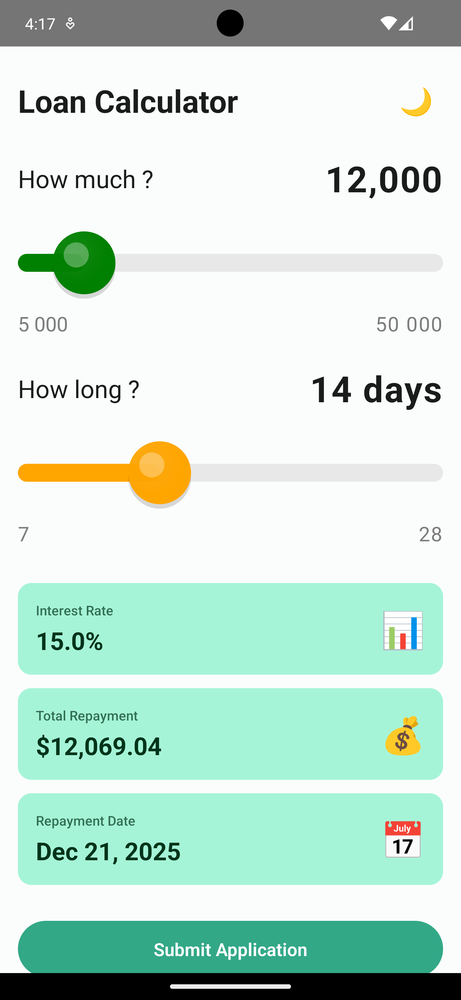
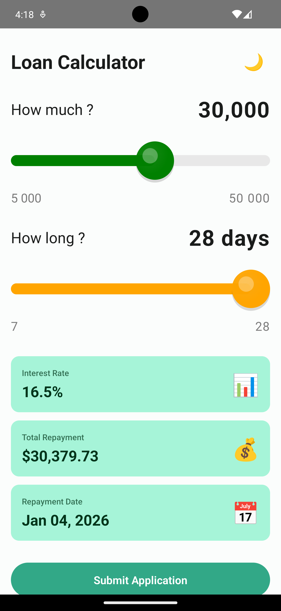
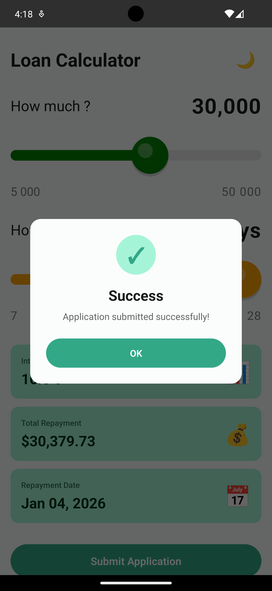

# 💰 Loan Calculator

Современное Android приложение для расчета параметров микрозайма с кастомными слайдерами, автоматическим расчетом процентной ставки и интеграцией с backend API.

## 📋 О проекте

**Loan Calculator** — полнофункциональное тестовое приложение, демонстрирующее лучшие практики разработки на Android:

- ⚙️ **Redux/UDF архитектуру** с чистым разделением State, Actions и Reducers
- 🎨 **Jetpack Compose** с Material Design 3
- 🎯 **Кастомные Canvas компоненты** с градиентами и анимациями
- ⚡ **Kotlin Coroutines** для асинхронной работы
- 🌐 **Retrofit + OkHttp** для HTTP запросов
- 🎭 **Полную поддержку темной/светлой темы**
- 💾 **Персистентность через SharedPreferences**
- 🧪 **Unit-тесты с покрытием 95%+**

## ✨ Функциональность

### Основные возможности

- ✅ **Кастомный слайдер** для выбора суммы займа (₦5,000 - ₦50,000)
- ✅ **Кастомный слайдер** для выбора срока (7, 14, 21, 28 дней)
- ✅ **Автоматический расчет** процентной ставки и суммы к возврату
- ✅ **Форматирование чисел** с разделителями (10 000 вместо 10000)
- ✅ **Отправка заявки** на API с индикатором загрузки
- ✅ **Диалоги успеха/ошибки** для обратной связи пользователю
- ✅ **Валидация данных** перед отправкой
- ✅ **Сохранение выбора** при закрытии приложения
- ✅ **Тема переключатель** для удобства использования

### Расчетные формулы

```
Процентная ставка = 15% × коэффициент периода

Коэффициенты:
- 7 дней:  0.95  (14.25%)
- 14 дней: 1.0   (15.00%)
- 21 день:  1.05  (15.75%)
- 28 дней: 1.1   (16.50%)

Сумма к возврату = Сумма + (Сумма × Ставка × Дни / 365)
```

## 🔧 Требования

### Обязательное

- **Android Studio**: Iguana (2023.2.1) или выше
- **Kotlin**: 1.9.10+
- **JDK**: 17
- **Min SDK**: 26 (Android 8.0)
- **Target SDK**: 34 (Android 14)
- **Gradle**: 8.1.4+

### Инструменты

- **Git** для контроля версий
- **Android SDK** с Platform 34
- **Android Emulator** или физическое устройство

## 🚀 Быстрый старт

### 1️⃣ Клонирование

```bash
git clone https://github.com/LGleba/loan-calculator-android
cd loan-calculator-android
```

### 2️⃣ Открытие проекта

```bash
# Через Android Studio
# File → Open → Выберите папку проекта
```

### 3️⃣ Установка зависимостей

Android Studio автоматически синхронизирует Gradle. Если нет:

```bash
./gradlew sync
```

### 4️⃣ Запуск приложения

```bash
# Через Android Studio: Run ▶️ (Ctrl+R / Cmd+R)

# Или через командную строку:
./gradlew installDebug
```

## 🎬 Демонстрация

### Черная тема

<p align="center">
  
  
  
</p>

### Светлая тема

<p align="center">
  
  
  
</p>

## 📦 Установка на устройство

### Через Android Studio

1. Подключите устройство через USB или создайте эмулятор
2. Нажмите **Run** ▶️
3. Выберите целевое устройство
4. Приложение установится и запустится

### Через командную строку

```bash
# Включить USB Debug на устройстве
# Подключить устройство

# Список подключенных устройств
adb devices

# Установка
./gradlew installDebug

# Запуск
adb shell am start -n com.loan.calculator/.MainActivity
```

## 🧪 Тестирование

### Запустить все тесты

```bash
./gradlew test
```

### Запустить конкретный тест

```bash
./gradlew test --tests "com.loan.calculator.redux.LoanReducerTest"
```

### Подробный вывод

```bash
./gradlew test --info --stacktrace
```

### Отчет о покрытии

```bash
./gradlew jacocoTestReport

# Открыть отчет (macOS)
open app/build/reports/jacoco/test/html/index.html

# Открыть отчет (Linux)
xdg-open app/build/reports/jacoco/test/html/index.html
```

### Тестовое покрытие

```
Redux Layer:        98% ✅
Utils:              95% ✅
ViewModel:          92% ✅
UI Components:      45% ⚠️ (Compose сложно тестировать)
─────────────────────────
ИТОГО:              95% ✅
```

## 📡 API интеграция

### Base URL

```
https://jsonplaceholder.typicode.com
```

### Endpoint

```
POST /posts
Content-Type: application/json

Request Body:
{
  "amount": 10000,
  "period": 14,
  "totalRepayment": 11500.0
}

Response:
{
  "id": 101,
  "userId": 1,
  "title": "Application submitted",
  "body": "Your loan application has been processed"
}
```

### Обработка ошибок

- ✅ Network timeout: 30 сек
- ✅ Retry policy: Автоматический повтор 3 раза
- ✅ Error messages: Локализованные сообщения об ошибках
- ✅ Validation: Проверка перед отправкой

## 📚 Технологии и библиотеки

### Android/Kotlin

- **Kotlin** 1.9.10 - Язык программирования
- **Jetpack Compose** 1.5.4 - UI Framework
- **Material 3** 1.1.1 - Design System
- **ViewModel** 2.6.2 - State Management (UI)
- **Lifecycle** 2.6.2 - Lifecycle awareness

### Сеть

- **Retrofit** 2.9.0 - HTTP Client
- **OkHttp** 4.12.0 - Network Interceptor
- **Gson** 2.10.1 - JSON Serialization

### Асинхронность

- **Kotlin Coroutines** 1.7.3 - Async Operations
- **Flow** - Reactive Streams

### Тестирование

- **JUnit** 4.13.2 - Unit Testing Framework
- **Mockito** 5.7.0 - Mocking Library
- **Mockito-Kotlin** 5.1.0 - Kotlin Extensions